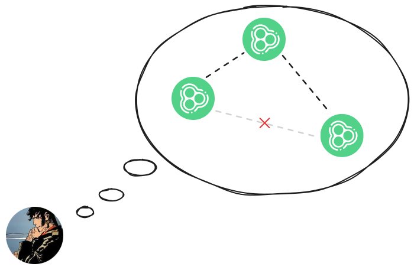

# KLogs

Distributed streaming on Unison Cloud

----
 
## About me




Notes:

I'm Fabio Labella, I'm the Principal Distributed Systems Engineer at
Unison Computing, so I spend most of my day thinking about Distributed
Systems design, and bringing it to life on Unison Cloud.


----

## Plan

- Designing _a_ streaming engine.
- Introduction to Unison Cloud.
- General techniques for distributed systems.

Notes:

So, plan for today. 
We will first look at the design of is a streaming engine, and I say
_a_ streaming engine because the design space is actually quite large,
depending on what use case your optimising your engine for, and then
on a myriad of architectural choices.
We'll then take a quick look at the main features of Unison Cloud, to
see which tools we have at our disposal to implement it.
And finally, we will dive into an actual distributed implementation,
which I hope will actually also serve as an introduction to several
general techniques and consideration for designing any distributed
system.
Let's get into it!

---

## KLogs

- &shy;<!-- .element: class="fragment" --> A streaming engine for OLTP. *(Not OLAP or ETL).*
- &shy;<!-- .element: class="fragment" --> *Roughly:* Kafka + a subset of Kafka-Streams.
- &shy;<!-- .element: class="fragment" --> Built entirely on Unison Cloud.
- &shy;<!-- .element: class="fragment" --> *Highly WIP and experimental*.

Notes:

KLogs is a streaming engine designed around OLTP, so transactional
processing at medium to high scale. Think about event driven logic
such as state machines or user workflows. It's not really intended for
analytical use cases where you want to run historical joins, or simple
ETL running at humongous scale, as we will see later when talking
about design tradeoffs.

It's roughly equivalent to the combination of a streaming platform
such as Kafka or Kinesis, plus a computation engine such as Kafka
Streams or Flink, although with more limited scope.

It's built in Unison and Unison Cloud from the ground up, but please
bear in mind that it is currently at prototype stage, there are still
missing features, unoptimised paths, etc.

----

### Api: KLog

```haskell
type KLog k v = ...
```

- &shy;<!-- .element: class="fragment" --> An infinite sequence of key-value pairs (messages).
- &shy;<!-- .element: class="fragment" --> Values for a given key are in FIFO order.
- &shy;<!-- .element: class="fragment" --> Values for different keys are independent and unordered.

----

### Api: pipelines


```unison [|1-6|1,5-6|1,3-4|1-6|1, 7-10|1,9-10|1,8|1, 7-10|1, 11|1,12|]
ability Pipeline where
  loop
    :  s
    -> (s -> k -> v ->{Remote} (s, [v2]))
    -> KLog k v
    -> KLog k v2
  partition 
    : (k -> v -> [k2])
    -> KLog k v
    -> KLog k2 v
  merge : [KLog k v] -> KLog k v
  sink : (k -> v ->{Remote} ()) -> KLog k v -> ()
```

- &shy;<!-- .element: class="fragment" -->Route messages to different keys.
- &shy;<!-- .element: class="fragment" -->Process each key sequentially, with state.
- &shy;<!-- .element: class="fragment" -->Different keys are processed concurrently.


Notes:

Let's look at the Pipeline ability, which is how you write logic over
KLogs.

Remember in a KLog, messages for the same key are in FIFO order, so
the first operation we can look at is `loop`, which is how you do
sequential per-key processing. You can see it transforms the values of
a KLog, and it does via a stateful transformation: it takes an initial
state, which is _per key_, and then a function that taken the old
state and a message, and returns the new state for that key and 0, 1
or more messages to send to the output KLog. `loop` gets called
sequentially any time there is a new message for a given key, and gets
called concurrently among different keys.

Since `loop` encodes transformations per-key, you then need a way to route
messages to different keys, which we can do with `partition`.
You can see that it transforms the keys of a `KLog`, with a function
that computes the new key for the message. It returns a list because
you can filter out the message by returning an empty list, or send
multiple copies of the input message with different keys.


Merge just takes a bunch of KLogs, and merges them into one by emitting
messages as soon as they arrive.

Partition takes a KLog k v and transforms it into a KLog k2 v, i.e it
reroutes messages by changing their key. Remember that messages with
the same key will be in FIFO order, so partition essentially group
messages for later linear processing.

And finally, sink lets you perform side-effects at the end of a Pipeline,
for example to write messages to external storage. We will talk about
Remote later, but for now think about it as a version of the IO
ability that works on Unison Cloud.

----

### Api: KLogs


```unison [|1,6-8|1,6|1,7|1,8|]
ability KLogs where
  tryDeploy : '{Pipeline} () ->{KLogs} Either Failure ()
  tryNamed : Text ->{KLogs} Either Failure (KLog k v)
  tryProduce : k -> v -> KLog k v ->{KLogs} Either Failure ()

KLogs.deploy : '{Pipeline} () ->{KLogs, Exception} ()
KLogs.named : Text ->{KLogs, Exception} KLog k v
KLogs.produce : k -> v -> KLog k v ->{KLogs, Exception} ()
```

&shy;<!-- .element: class="fragment" --> Handler decides _where_ pipelines are deployed.

Notes:

Ok, now we need an api to interact with our pipelines, which is the
KLogs ability.
Let's look at the helpers which have nicer types:
- deploy deploys a pipeline to start running it
- `named` creates or retrieves a named KLog to pass to our pipelines
- and produce lets us write messages to a KLog, so that we can
  interact with KLogs from the outside world

You might be wondering _where_ its the ability deploying pipelines or
storing klogs, but KLogs is an ability so we can abstract that choice
away: the appropriate handler will decide.

----

### Example

```unison
example : '{KLogs, Exception} ()
example = do
  upper: KLog Text Nat
  upper = named "word-counts-uppercase"
  
  lower: KLog Text Nat
  lower = named "word-counts-lowercase"
  
  pipeline = do
    Pipeline.merge [upper, lower]
    |> Pipeline.partition (k _ -> [Text.toLowercase k])
    |> Pipeline.loop 0 cases _ counter value ->
         newCount = counter + value
         (newCount, [newCount])
    |> sink printCountJson

  KLogs.deploy pipeline

  upper |> KLogs.produce "F" 1
  -- {"type":"OUT","name":"f","count totals":1}

  upper |> KLogs.produce "M" 3
  -- {"type":"OUT","name":"m","count totals":3}

  lower |> KLogs.produce "f" 4
  -- {"type":"OUT","name":"f","count totals":5}
  
  upper |> KLogs.produce "M" 4
  -- {"type":"OUT","name":"m","count totals":7}
```

Notes:

We have two key logs, both representing a stream of words with
respective counts from somewhere, however one KLogs is counting
uppercase words, the other lowecase, we want to do a case insensitive
count.

---

## Intro to Unison Cloud

- &shy;<!-- .element: class="fragment" -->Computations can move across nodes.
- &shy;<!-- .element: class="fragment" -->Deployments are just code.
- &shy;<!-- .element: class="fragment" -->Transactional storage.
- &shy;<!-- .element: class="fragment" -->... and more!


Notes:

Ok, at this point we have to take a brief detour to introduce the main
Unison Cloud features that we will use in our implementation.
First of all, computation can move across machines without explicit
serialisation or networking code.
Deployments are just Unison code, without a separate infrastructure setup.
And we have an integrated transactional storage layer.
There's actually a lot more to it, but let's get into it.

----

### Remote: concurrent api

```unison  [|1|1-4|1-7|1-11|]
  sleep: Duration ->{Remote} ()

  spawn: '{Remote} a ->{Remote} Thread
  cancel: Thread -> Unit

  scope : '{Remote} a ->{Remote} a
  addFinalizer : (Outcome ->{Remote} ()) ->{Remote} ()
  
  Ref.new: a ->{Remote} Ref a
  Ref.readForCas: Ref a ->{Remote} (Ticket a, a)
  Ref.cas: Ref a -> Ticket a -> a ->{Remote} Boolean

  Promise.empty : '{Remote} Promise a
  Promise.read : Promise a ->{Remote} a
  Promise.write_ : Promise a -> a ->{Remote} ()
```

Notes:
We mentioned the Remote ability before, and the first you can look at
it is as the equivalent of the IO ability, but in the cloud.
It's basically a concurrency api:
- you can sleep
- you can spawn a thread and cancel it
- you can delimit a scope, and register finalizers in that scope that will run when
  then code terminates or fails or gets cancelled
- you can create mutable references that can modified atomically via
  optimistic concurrency
- and you can block on a condition by representing it as a one-shot
  Promise. Reading an empty promise will block, and writing to it will
  unblock any readers.
  
----

### Remote: ~~Concurrent~~ Distributed api

```unison [|1|1-5|1-7|]
type Location g = ...

here : '{Remote} Location {}
near : Location g -> Location g2 ->{Remote} Location g
far : Location g -> Location g2  ->{Remote} Location g

detachAt : Location g -> '{g, Remote} a ->{Remote} Thread

type Thread = ... Location.Id
type Ref a = ... Location.Id
type Promise a = ... Location.Id
```
- &shy;<!-- .element: class="fragment" -->The whole Remote api works across nodes.
- &shy;<!-- .element: class="fragment" -->We can parallelise by forking _here_.
- &shy;<!-- .element: class="fragment" --> We can _scale out_ by forking _far_.
- &shy;<!-- .element: class="fragment" --> We can communicate via Ref+Promise.
- &shy;<!-- .element: class="fragment" -->Guarantees degrade accordingly.

Notes:

However, Remote is actually a fully distributed api.

It has this concept of a Location, which can be something like another
core, but also another machine in a datacentre, or even another
geographical region.

We'll see what the `g` type parameter is in a bit, but for now note
how we have an api to retrieve locations.

Then, the main forking combinator, `detachAt`, takes a location to
fork the code to.
Not only that, but Thread, Ref and Promise all carry their location.

So, as a result, the whole Remote api works across nodes.
This means that we can parallelise by forking here.
But we can also scale out by forking far.
Ref+Promise can be used to communicate, replacing explicit networking code.

Obviously, guarantees degrade accordingly: for example you can always
`cancel` a computation on the same node, but might fail to cancel a
computation far away if there's a network partition.
We will later see how to exploit the blurred lines between concurrent
and distributed code.
succeeds on the same node, but cannot cancel a partitioned node far
for example finalizers won't run if the node is hit by an asteroid.
But we'll later see how to exploit this unified api regardless.

----

### Remote: Typed Locations

```unison
type Location g = ...

Cloud.pool : '{Remote} Location {Http, Storage, Log, ...}

detachAt (far pool() here()) do
  Log.log "Hello from a distant world!"
  ...
```

- &shy;<!-- .element: class="fragment" -->Locations are typed with the effects they support.
- &shy;<!-- .element: class="fragment" -->Unison Cloud comes with a rich set of effects.
- &shy;<!-- .element: class="fragment" -->We can safely sends programs to another node.

Notes:
Ok, one more detail about Locations, they are typed with the set of
abilities they support.

Unison Cloud provides a pool of nodes with a rich set of effects.

And as a result we can safely send programs to another node, in this
example we're forking to a node far away and logging a message there,
and the code won't compile if we try to fork to a node that doesn't
support logging.

----

### The Cloud ability

```unison
Environment.default : '{Cloud} Environment
Cloud.submit: Environment -> '{Remote} a ->{Cloud} a
...

Cloud.run: '{Cloud} a ->{IO, Exception} a

Cloud.run do
  Cloud.submit Environment.default() myOneOffJob
```

- Entry point for Unison Cloud.
- Putting *code* back in infra-as-code.
- &shy;<!-- .element: class="fragment" -->Supports local testing:
  ```
  Cloud.run.local do ...
  ```
- &shy;<!-- .element: class="fragment" -->What about long-running processes?
----

### Daemons

```unison
type Daemon = ...

Daemon.named : Text ->{Cloud} Daemon
Daemon.deploy : 
  Daemon -> Environment -> '{Remote} Void ->{Cloud} ()
```

- &shy;<!-- .element: class="fragment" -->Serverless long-running processes.
- &shy;<!-- .element: class="fragment" -->Restarted when underlying infrastructure changes.
- &shy;<!-- .element: class="fragment" -->One or more instances running at any given time.
- &shy;<!-- .element: class="fragment" -->Low level.

----

### The idea

We can implement distributed systems by deploying a `Daemon` that spawns `Remote` threads.

----

### Storage

- &shy;<!-- .element: class="fragment" -->Typed key-value store.
- &shy;<!-- .element: class="fragment" -->Supports multi-key transactions.
- &shy;<!-- .element: class="fragment" -->Transactions are Unison programs.
- &shy;<!-- .element: class="fragment" -->Can be used to build arbitrary datastructures.

----

### Storage api

```unison [1|1-6|1-11|1-8, 10|1-8, 11-13|1-9,14|]
type Table k v = ...

ability Transaction where
  write.tx : Table k v -> k -> v -> ()
  tryRead.tx : Table k v -> k -> Optional v
  delete.tx : Table k v -> k -> ()

transact
  :  Database
  -> '{Transaction, Exception} a
  ->{Storage, Exception} a
  
Cloud.pool : '{Remote} Location {Storage, ...}
Database.named : Text ->{Exception, Cloud} Database
```

----

### Linear Log 

```unison
type LinearLog a = {
  db: Database
  index: Table () Nat,
  values: Table Nat a,
}

LinearLog.size.tx: LinearLog a ->{Transaction} Nat
LinearLog.size.tx log = 
  tryRead.tx (index log) () |> getOrElse 0

LinearLog.add: LinearLog a -> a ->{Storage, Exception} ()
LinearLog.add log v = transact (db log) do
    i = size.tx log
    write.tx (values log) i v
    write.tx (index log) () (increment i)

LinearLog.from: LinearLog a -> Nat ->{Remote} [a]
LinearLog.from log start =
  run p = toRemote do transact (db log) p
  end = run do size.tx log
  List.range start end
    |> Remote.parMap (n -> run do tryRead.tx (values log) n)
    |> somes
```

----

### Recap

- **Remote**: concurrent & distributed control flow.
- **Cloud**: deploy with a function call.
- **Daemons**: low level long-running processes.
- **Storage**: durable data structures with transactions.

---

## Design plan

show pipeline again
show that klogs are ids
show the idea of stages, and how we name klogs
show diagrams and various types of concurrency
shards vs threads, and general shape
workers and sharding/key assignment
mention sequential correctness requirement
later we'll see how to guarantee correctness
at some point I have to also show pipelines being translated
then, shape of the loglets, and notification log shapes
simple write path

then I have to figure out rebalancing and optimisations


 
# End

Notes:

latest workaround: just add &shy;<!-- .element: class="fragment" -->
before your item content (when they contains links or anything non
text).

- &shy;<!-- .element: class="fragment" --> **This** is item one.
- &shy;<!-- .element: class="fragment" --> This is [item](https://...) *two*.
